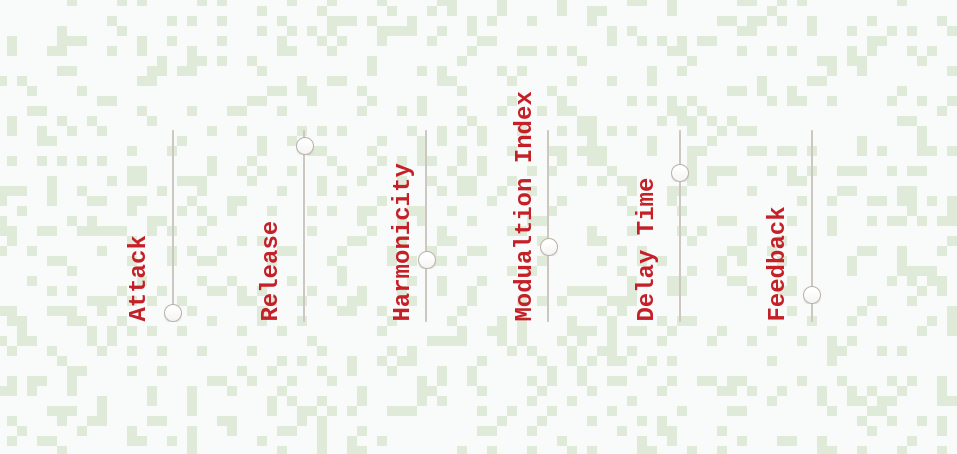

## Conway's Game of Life

Sound of Life is a musical interpretation of [Conway's Game of Life](https://en.wikipedia.org/wiki/Conway%27s_Game_of_Life). The game consists of a 2D board made up cells that are either 'alive' or 'dead'. Each round the state of a cell is decided by three simple rules.

1. Any living cell with two or three living neighbours stays alive.
2. Any dead cell with three live neighbours comes to life.
3. Any live cell with less than 2 living neighbours or more than three living neighbours dies.

Conway's Game of Life is a zero player game. There are no winners or losers, the evolution of the game is decided by how the cells are placed on the board.

You can watch the game unfold by clicking the Start Game button at the top. The board has been pre-populated with a randomized selection of living and dead cells. You can change the time between rounds using the Game Speed control at the top.

Living cells can be placed or removed by clicking on the board. A random selection of cells can be generated by clicking the randomize button.

## The Sequencer

In addition to the implementation of the Game of Life, Sound of Life features a musical sequencer that plays back different notes depending on the number of living cells in the game and their location on the board.

The board is divided up into 10 columns and 10 rows. Each row is assigned a different note depending on which scale has been selected. While the sequencer is running, it steps through the columns one by one. For every column the number of active cells in each row is counted up. The sequencer then plays the note corresponding to the row with the most active cells.

This leads to some interesting generative melodies that change gradually over time. If you find a melody that you like the Game of Life can be stopped and the melody will repeat indefinitely.

## The Synthesizer

All of the sound is generated using a simple two operator FM synthesizer that is fed into a delay effect. The parameters of the synthesizer can be viewed by clicking the Show/Hide Sound Controls button above the game board. Here is a quick breakdown of how each slider effects the sound.

### Attack:

This is the initial stage of the synthesizers volume envelope. A fast attack time will give a stacatto sound (think harpsichord) and a slow attack will give a softer more gradual increase in volume (think softly played violin).

### Release:

This is the second stage of the synthesizers volume envelope. A fast release time means the sound will end abruptly. A slow release time means the sound will gradually fade away.

### Harmonicity and Modulation Index

To understand what harmonicity and modulation index are doing you first need to understand how an FM synthesizer works and this is a topic all on its own. You don't need to understand how they work if you just want to make interesting sounds. These two controls interact with eachother a lot and affect how bright or harsh the sound will be. If you are interested in understanding how an FM synthesizer works in more detail then [this video](https://www.youtube.com/watch?v=vvBl3YUBUyY) is a great place to start and gives a much better explanation than I could.

### Delay Time

A delay creates an echoing effect on any sound that is passed through it. The Delay Time control adjusts the time in between each echo.

### Feedback

Feedback controls how much of the echo is fed back into the Delay. Higher feedback means that the delay will repeat for longer. Low feedback values mean that the Delay will only repeat for a short amount of time.

_If you haven't had much experience with synthesizers don't worry if this all seems confusing! The best thing you can do is experiment with the controls to get a feel for how each changes the sound. Understanding how the sound is generated is not a prerequisite for using this application! If you get stuck just refresh the page and everything will be reset._

If you just want to experiment with the Game of Life and want to see how it works with larger game boards then check out my other implementation by [clicking here](https://github.com/gabrieldavison/conways-game-of-life).
